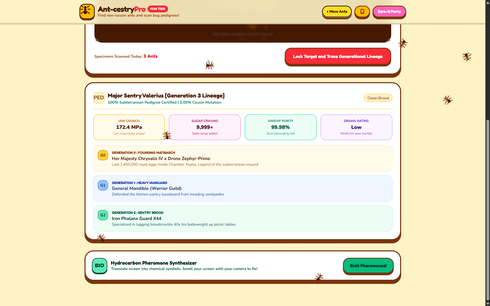
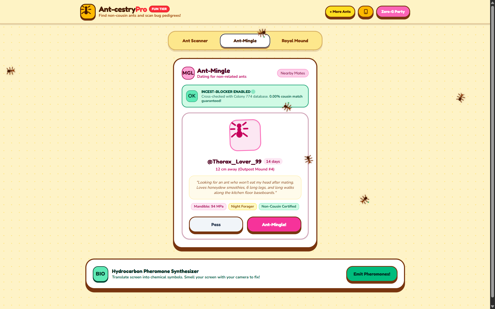
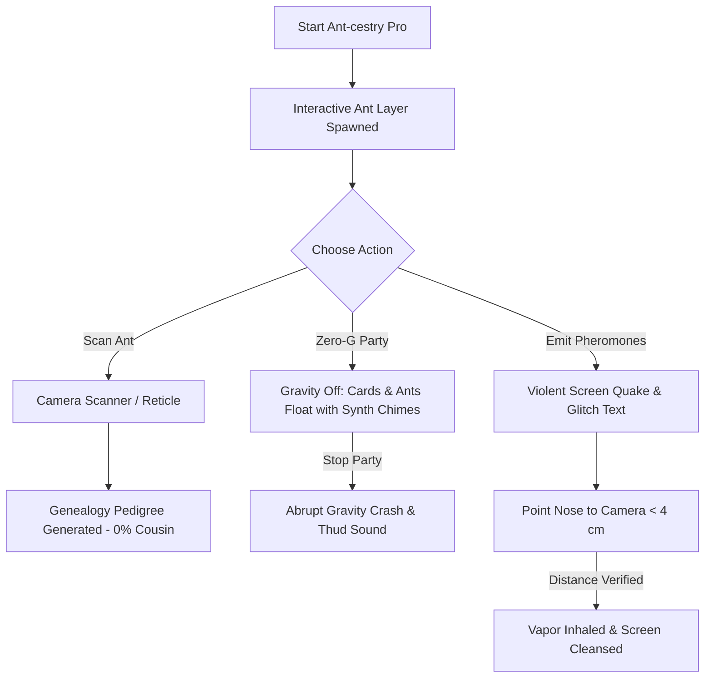
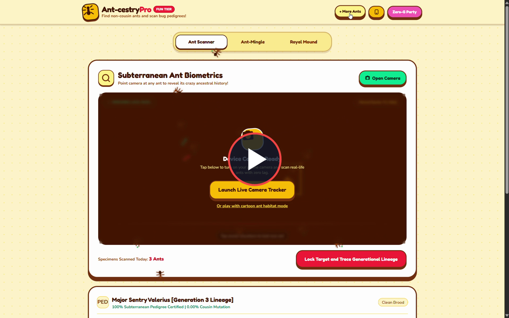

# Ant-cestry Pro 🐜🎯


## Basic Details
### Team Name: Formic Pioneers


### Team Members
- Team Lead: Karthik V Gopal
- Member 2: Devinanda

### Project Description
Ant-cestry Pro is a playful, comic-styled bug-kinship and ant-genealogy web application that uses computer vision to inspect countertop ants, scan bug pedigrees, and simulate zero-gravity parties. It features an olfactory pheromone cleanser where users must physically point their nose directly at the camera lens (< 4 cm) to stop a violent screen-shaking glitch.

### The Problem (that doesn't exist)
Every day, billions of ants walk past each other on kitchen countertops, picnic mats, and sidewalks without knowing their family tree. Are they 3rd cousins once removed? Are they accidentally dating within their own subterranean colony? Until now, the insect kingdom had zero digital pedigree tools to avoid awkward subterranean family reunions.

### The Solution (that nobody asked for)
We built Ant-cestry Pro:
1. An Ant Pedigree Scanner with real-time targeting reticle analyzing bug lineage (e.g., 73% Red Harvester, 0% Cousin Guarantee).
2. A Zero-G Party button that detaches all UI cards, headers, and screen-crawling ants to float in weightless space before abruptly crashing back down with a physical thud.
3. A Pheromone Tester that violently shakes the entire screen (`@keyframes screenQuake`) and glitches all text into chemical symbols, which can ONLY be cleansed when the user brings the tip of their nose within < 4 cm of the front camera lens.
4. Interactive screen ants that crawl across your device and scurry in panic when tapped.

## Technical Details
### Technologies/Components Used
For Software:
- Languages: HTML5, CSS3, Modern JavaScript (ES6+)
- Frameworks: TailwindCSS (via CDN)
- Libraries: WebRTC `getUserMedia`, HTML5 Canvas API (Chromaticity skin & nose tracking), Web Audio API (Procedural tone synthesizer)
- Tools: VS Code, Vercel, MinGit

### Implementation
For Software:
# Installation
```bash
git clone https://github.com/KVG290/ant-cestry.git
cd ant-cestry
```

# Run
```bash
# Open index.html directly in any web browser:
start index.html

# Or deploy to Vercel in 1 click (zero configuration required)
```

### Project Documentation

# Screenshots (Add at least 3)

*Ant-cestry Pedigree Scanner: Real-time viewfinder targeting ant coordinates with lineage percentage breakdown.*


*Zero-G Party Mode: All cards and UI elements detaching and floating weightlessly in space.*


*Pheromone Screen Quake & Olfactory Cleanser: Violent screen shaking with nose-distance tracking reticle (< 4 cm).*

# Diagrams

*Workflow diagram illustrating camera scanning, Zero-G party state transitions, and the nose-cleansing feedback loop.*

### Project Demo
# Video

[](Screen%20Recording.mp4)

🎬 **[▶ Click Here to Watch the Full Demo Video (Screen Recording.mp4)](Screen%20Recording.mp4)**

*Live screen recording demonstration showing real-time countertop ant pedigree scanning, Zero-G Party gravity suspension and abrupt drop, interactive crawling ants, and the violent pheromone screen quake neutralized by bringing the nose within < 4 cm of the camera lens.*

# Additional Demos
- Animated Action Preview: [demo-preview.gif](demo-preview.gif)
- Live Web Deployment: [https://github.com/KVG290/ant-cestry](https://github.com/KVG290/ant-cestry)

## Team Contributions

- Karthik V Gopal: Technical architecture, computer vision & canvas chromaticity nose tracking engine, procedural Web Audio synthesizer, Zero-G floating physics, and Vercel deployment.
- Devinanda: UI/UX design & comic aesthetic, Colony Mingle ant persona curation, bug pedigree taxonomy research, and testing & verification.

---
Made with ❤️ at TinkerHub Useless Projects 


